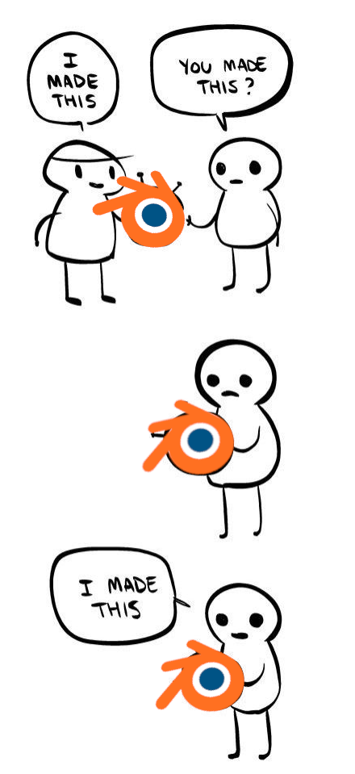
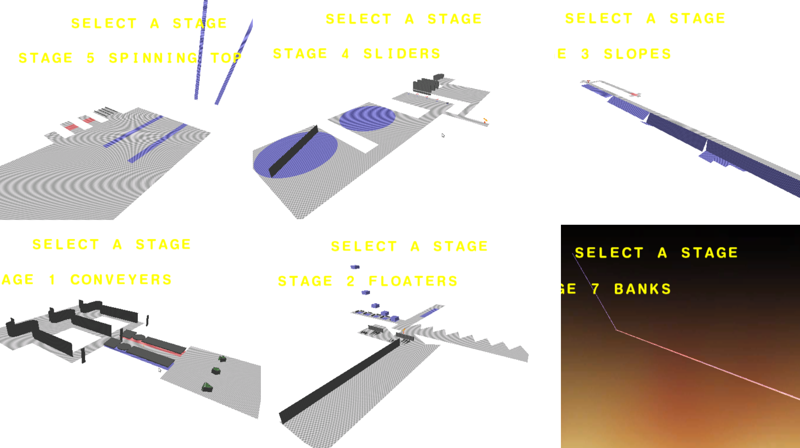
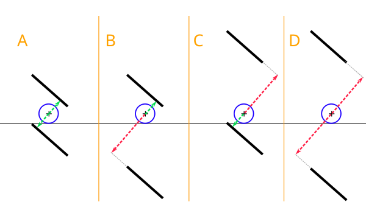

Hi! I'm ComplexPlane. I first joined the team for a brief period this past summer, but then I took a bit of a break soon after. Now I'm back, and I'm working on improving Rolled Out's physics!

Implementing collision physics in Rolled Out! isn't as simple as tweaking Unreal's built-in physics engine to make it work as we want; instead, we're implementing our own collision algorithms. Bites did an excellent job explaining why we might want to do this in our first dev blog, I'll copy it here:

> Most physics engines perform calculations in discrete distances and steps, where an object exists in one position on frame 1, and a different position on frame 2, where all of the space between those frames isn’t tested. This means in a typical physics simulation, something moving at a sufficiently high velocity can travel through other objects - a phenomenon referred to as ‘tunneling’.
>
> We’re aiming for a completely continuous simulation, where no matter how fast either the ball or a stage object moves, the interaction is always what you would expect. This isn’t as hard as it sounds if you’re building physics objects to certain specifications - constructing their collision out of one or more convex hulls (shapes which all vertices point ‘outwards’) makes the math for this simpler. Doubly so if you only want to translate - no rotation. However, we have objects which consist of completely arbitrary shapes, which can move and rotate in absolutely any way desired by the level designer.

In my opinion, Super Monkey Ball's ball-stage collision behavior is quite special because it seems to handle so many ridiculous situations in surprisingly coherent ways. 

For one, SMB provides robust Continuous Collision Detection (CCD): no matter how fast your ball is going (ball speed is _not_ capped!), and no matter how nutty or fast-moving your stage is, SMB will prevent teleportation in most cases.

SMB also has pretty interesting _depenetration_ behavior. In most 3D game physics systems, depenetrating the player from the world looks something like this:

1. Move the player a tiny bit, depending on their velocity
2. Check if the player is intersecting the world
3. If so, move the player back inside the world so they're no longer intersecting with it

SMB doesn't quite work this way, however! Although in most cases it will completely depenetrate the ball from the stage, in other cases it will allow the ball to remain partially-intersecting the stage between frames! That's... weird. But the weirder part is, this seems to make the physics behavior _more_ robust and sensible, not less!

And remember, SMB manages to do all of this with stages comprising a large number of triangles, while running at 60FPS on a Nintendo Gamecube.

I believe there's a lot we can learn from the original SMB games that could greatly influence our approach to building Rolled Out!'s physics. While Rolled Out! in its current form can handle stage-ball collision very nicely for _static_ stages, our attempts to handle _moving_ stages still cannot hold a candle to SMB's physics engine!

But how could we further investigate SMB's physics, and maybe learn something along the way? By breaking the game, of course!

Okay well, how about a more principled way to put it: we can carefully observe how the game handles collision under specially-crafted circumstances. We can manufacture these specially-crafted circumstances by building some custom levels for SMB, and seeing what the game does with them!

Over the last few weeks, I've been working closely with Bites to design some custom stages which may expose some of the inner-workings of SMB physics. And by "working closely with Bites", I mean "poorly describing some stage ideas to Bites, watching him actually labor over creating the goofy stages in Blender, and then acting like I did something".

Here's some of the physics test stages we've made!

We've learned a lot over the process of iteratively making, testing, and making more of these stages, but for the conciseness of this blog post, I'll go into one particular phenomenon we're pretty certain understand better now.

One gimmick we've employed across the test stages in a variety of ways is using triangles which change their position and/or rotation in a single frame, rather than smoothly across many frames. By doing this, we can better guess at what SMB's physics is doing _per frame_.

Take this situation: a simple box starts below the stage, and in one frame it moves above the stage, completely passing through a ball resting on the stage. Yet, _you will still get hit!_

This is CCD in action; clearly the game is not simply checking whether the box's final position would intersect the ball. Detecting whether a continuously translating sphere and a continuously translating+rotating triangle would ever intersect isn't exactly straightforward to do efficiently, either. Something else is going on here.

Upon closer inspection, we see this:

It seems like the ball doesn't hit the box unless more than half of the ball is over it! Hmm...

What happens if we put a donut shape under the ball?

So long as the donut also passes completely through the ball in a single frame, it seems like we also don't get hit! Maybe it's using the ball's center as some sort of reference?

These examples so far only looked at collision with _translating_ triangles, but what about rotating triangles?

Here's a platform that rotates 90 degrees in a single frame periodically.

Seems consistent enough with our previous observations: you get hit when the ball's center is in the way.

This test really stumped us though. It's a similar rotating platform, but instead of rotating to angles of 0, 90, 180, and 270 degrees, it's on the diagonals: 45, 135, 225, and 315 degrees. Make sure to watch the minimap: the blue strip on the ground is where the rotating platform passes through the ground.

You get hit _way_ further away from the platform than you would expect! What could the game be doing? Is it just some weird bug or edge case that we don't care about, or is it illustrating something relevant?

I had a theory, and an idea for one more test stage which might help prove it. Rather than showing you a long video, a couple simple 2D diagrams should describe it more easily.

The lines represent triangles, and the circles represent the ball. In each of the four situations, the triangle moves from the higher position to the lower position in one frame. As it turns out, the ball is hit in situations A, B, and C, but not in situation D!

Here is what I think is happening: for a given triangle, the game checks whether the ball's center _projects into_ the triangle either before or after the frame. However, the game also checks whether the ball is facing the _front_ of the triangle _before_ its animation, as well as facing the _back_ of the triangle _after_ its animation; otherwise, the ball could collide with triangles that don't pass through it! This ball-center-projection appears to be a key part of Super Monkey Ball's CCD.

Here's a neat demo Bites made which exposes the discovery in a simple way:

Anyway, there's a lot of other theories and code-related stuff I could continue on about, but that'll be all for this post. Look forward to more next time!
