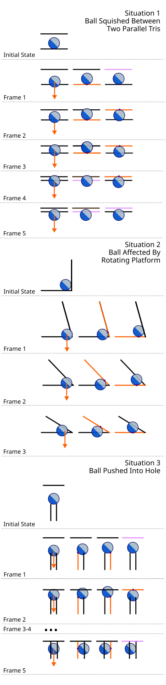

# ComplexPlane: Substantial Improvement in Collision Physics

We've made a lot of progress on our collision physics during the last two weeks! The ball's interaction with the stage, whether it's with a stationary part or an animated part, now feels quite smooth, correct, and a lot more like Monkey Ball.

I've spent a lot of time in voice calls with Bites, CraftedCart, and CraftSpider recently, and they've tremendously helped the process of implementing and testing some of these new physics ideas. Special thanks to Bites for constantly feeding me ideas to help rapidly debug and refine things as we went along, to CraftedCart for tackling some dreaded axis-related bugs for our stage import/export code, and to CraftSpider for some of the math code they'd written before and for implementing a fix to a stage animation loop-point bug.

Here's a small demo video which was posted to Discord and Twitter: 

The demo's a bit brief though; be sure to hang out in Bites' development stream or watch some of our beta testers to see more of the physics in action!

Although it took us quite some time to boil down the ideas that led to this improvement, the math itself is actually pretty simple! In this blog post, let's go over one of the ideas behind the new physics.

## Triangle-Centric Collision

Whether you're a game player or a game developer, it's normal to conceptualize your experience from the perspective of the virtual player which you control. In the case of the ball and the stage, it's natural to ask: does the ball hit the stage? If so, where and how? Stages are made of [many triangles stitched together](http://www.cmap.polytechnique.fr/~peyre/images/test_remeshing.jpg), so this boils down to: given the ball's position and velocity at some given time, which triangle(s) does the ball hit, how does the ball hit them, and how should the collision affect the ball?

It's tricky to implement something with this ball-first mentality in practice though in our case. The ball can potentially interact with several different triangles in rapid succession, especially considering how fast the ball can move and how wacky our stages' animation can be, and it's not immediately clear how to resolve every case. We want to give a sensible result for each potential collision which lets the player remain in control of the ball.

During the stage testing in Super Monkey Ball 2 I did with Bites (which I discussed in the last blog post), I observed that the game appears to take a simple, reversed approach: for each frame of the game loop, check each triangle in succession, and only once, to see if it would collide with the ball. If so, apply a collision to the ball: _depenetrate the ball_ by moving the ball onto the triangle, and _apply a collision response to the ball_ by setting a new velocity for the ball as a result of it bouncing off the triangle.

Although maybe not apparent at first, this very straightforward approach vastly improves the robustness of ball-stage interaction in many cases.

* Each triangle "does its best effort" to affect the ball, but once it's tested, it isn't tested again. We never get caught in a loop where the ball bounces around and interacts with the same triangles repeatedly in a single frame.
* By only considering each triangle once, we permit the ball to exist "inside the stage" between frames. This might seem like a bad thing at first; wouldn't we want the ball to be _on the stage_ at all times? If the ball rams into a concave corner at high speed, or if a platform squishes the ball between two surfaces at once, it's often more sensible to permit the ball to partially intersect the stage for a while.
* Trying each triangle once in a row is an inherently ordered operation. If we try each triangle in the same order each frame, the ball should behave more consistently when it needs to interact with more than one triangle simultaneously. Ever noticed how on Monkey Ball 2 stages like [Totalitarianism](https://vignette.wikia.nocookie.net/supermonkeyball/images/7/74/015rings.png/revision/latest/scale-to-width-down/310?cb=20190523203407) or Dribbles, if you're hit directly overhead by a ring or dribble, you're always sent _through the ground_, not the ring/dribble? Consistent triangle ordering is what defines this behavior, I believe.

## Examples

In each frame, the ball's position is first affected by gravity and its current velocity, as indicated by the orange arrow (for this post, we'll assume the ball has minimal initial velocity). It is then affected by each triangle (black line) in an arbitrary but consistent order. Orange means a triangle was tested and a hit was detected, and pink means a triangle was tested and a hit was not detected.

In situation 1, the ball will always collide with the top triangle last, so the ball will consistently get pushed into the lower triangle over time. Eventually, the ball will fall through the ground. Something to note is that we (as well as Super Monkey Ball 2, apparently) don't count a collision if the ball has passed more than halfway through the triangle. This trick improves robustness when the ball is pushed through the stage.

In situation 2, a rotating triangle pushes the ball to the left over time. Since the ground triangle is always tested last, the ball tends to intersect the rotating triangle a bit between frames. Because the ball may remain intersecting the stage, it makes smooth and steady progress rolling to the left, as opposed to more jumpy and drastic progress.

In situation 3, the ball is pressed into a hole in the ground. In frame 1, the ball is affected by the top edge of each vertical triangle in succession, placing it on top again. In frame 2, the same thing happens but the ball is depenetrated away from the top triangle such that it intersects both vertical triangles again. If we fast-forward to frame 5, we get a slightly different but still pretty consistent behavior: the ball rests on the face of the right vertical triangle.

And finally, here are a couple real illustrations of this behavior in Rolled Out, courtesy of Bites:

## Next Time

There's a lot I didn't cover for the new physics: I was going to write a bit more, but this much already took longer than I thought, hah. For example, how we handle triangle _face_, _edge_, and _vertex_ collision in particular really helps the new physics have good behavior. Maybe next time?

Also, while the physics certainly feels better than it did before, there's still much work to do! Next up, I will be looking into the following:

* Performance optimization with a spatial acceleration data structure
* Better ball restitution and friction behavior during simultaneous multi-object collision
* Better friction behavior on sloped surfaces
* Better continuous collision detection

Anyway, see you next time, hopefully!
