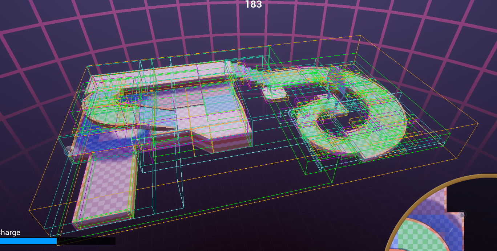

<!--

# Ideas (ignore)

https://www.youtube.com/watch?v=jres9YDi0Fs

## BVH Basics

How traversal works
    Only explain how finding candidates works for a _single iteration_; multiple iterations and CCD integration/sorting will come in last section
Why we use a separate BVH for each object
Why not other spatial acceleration structures
Small aside about BVH library I chose to use?

## New CCD Method

Discovered that CCD method (projection tests) discussed in [this blog post]() is not completely accurate
And on top of that, it won't work with a BVH because can't do projection tests in logarithmic time, etc
So we need a new method that's both pretty accurate and lets us use it with a BVH

Explain new line trace method, and why we do it in local-space
"It doesn't matter whether you drive your car 80mph into a brick wall, or the brick wall uhh, drive 80mph into you. They're essentially the same."

## BVH + CCD

Explain sorting discrete candidates and CCD candidates, eliminiating old triangles, when to reposition the ball and redo the BVH traversal, link to blog post where we discuss how to count a triangle collision and single-triangle rule

Show candiate triangles demo here?

## On the Docket

Special objects
Friction investigation

-->

# ComplexPlane: Faster Collision Physics

Hey again! Over the past month, I've been making a steady stream of improvements and tweaks to our new collision physics. As for some smaller things, I've worked with Bites to fix Morris's character animation and the ball's collision effects, but most of my work has gone towards improving the collision physics' performance.

## Spatial Acceleration Basics

If you recall<!-- from [this blog post](https://blog.rolledoutgame.com/2019/12/15/dev-update-11/) -->, stages in Rolled Out are [triangle meshes](http://www.cmap.polytechnique.fr/~peyre/images/test_remeshing.jpg) and we compute how the ball interacts with the stage by determining how it collides with the stage's triangles. There's something we need to contend with though: if our collision algorithm works by checking every triangle in the stage on each frame, our physics will slow down substantially as our stages grow in triangle count. Lucky for us, we can deal with this issue by using a _spatial acceleration structure_, which is a data structure that allows us to accurately detect ball-stage collisions without needing to check every individual triangle. An acceleration structure divides the stage into large regions, which are then divided into smaller regions, which are divided into even smaller regions, and so on. By intersecting the ball with these regions, we can eliminate the need to directly check most triangles in the stage in the first place. More on that in a bit.

### Bounding Volume Hierarchies



I ultimately decided to use a binary Bounding Volume Hierarchy (BVH) as the acceleration structure. A BVH divides the stage into two distinct sets of triangles, and creates an [axis-aligned bounding box (AABB)](https://en.wikipedia.org/wiki/Bounding_volume) around them. These two sets of triangles are generally chosen such that their bounding boxes are as large and non-overlapping as possible. This process repeats again _for each new bounding box of triangles_, until the lowest-level bounding boxes only contain a single triangle.

<!-- TODO rewrite this paragraph? -->
BVHs are an excellent acceleration structure for stage meshes because they are non-uniform; they can be generated to tightly map to stages with many triangles concentrated in some regions of space but not so many triangles in other regions of space. This is in contrast to other acceleration structures such as [octrees](https://en.wikipedia.org/wiki/Octree) or [grid systems](https://www.scratchapixel.com/lessons/advanced-rendering/introduction-acceleration-structure/grid) which are more uniform.

It requires some care to generate efficient, high-quality BVHs however, so it made sense to use some pre-existing code to do so. I chose to use [NanoRT](https://github.com/lighttransport/nanort), a very small _raytracing_ library, as it doesn't provide much extra functionality outside of generating BVHs from triangle meshes and intersecting rays with them. In addition, NanoRT provides low-level access to its BVH data structure, which is necessary for us to implement our custom collision physics on top of it.

### BVHs for Animated Stages

The BVH for a particular stage is generated just a single time prior to playing the stage so that we don't regenerate it on every frame. But what about if the stage has _animations_? Any BVH we would build for the entire stage would become invalid on each frame as the stage triangles themselves would change. We can't just build a BVH each frame, because that's no faster than testing each triangle individually without a BVH at all! The solution is easy, however: build a separate BVH for each animated object which moves alongside it.


So long as our stages don't contain an excessive number of distinct animated objects, this is still very performant.

### BVH Traversal

To detect collisions without checking every triangle in the mesh, we must traverse the BVH. There are a couple ways to traverse the BVH depending on exactly what we're doing, but for now, let's say we want to figure out which triangles an arbitrary sphere is intersecting.

First, we check whether the sphere intersects either of the two top-level AABBs.
If the sphere _does not intersect with an AABB_, then we can completely disregard _all triangles contained within this AABB_. After all, if the sphere doesn't intersect their bounding box, it certainly must not be touching any triangles contained within!
If the sphere _does_ intersect the AABB, we repeat the process with _all AABBs contained inside it_. This repeats until we reach individual triangles, at which point a normal sphere-triangle intersection test may be performed.


Because we roughly eliminate half of all triangles on each iteration, we say that a BVH traversal algorithm like this _runs in logarithmic time_. This is _much_ faster than checking each triangle individually, which takes _linear time_.

In the following sections, let's take a closer look at how BVHs were used to implement collision physics in Rolled Out.

## New CCD Method

First, we need to revisit Continuous Collision Detection (CCD). If you recall [yet another blog post](https://blog.rolledoutgame.com/2019/12/01/dev-update-10/), CCD refers to detecting collisions even in situations where the ball could pass entirely through the stage in a single frame. In that post, I described a CCD method which involves projecting the ball's center into stage triangles. This approach actually has some major issues, however. For one, it's not particularly robust, and doesn't appear to be precisely what Monkey Ball 2 uses in any case; using it, you can still teleport through stages in Rolled Out in somewhat reasonable circumstances. The larger problem, however, is that this CCD method requires testing each triangle individually, and cannot be rewritten in terms of an efficient BVH traversal as far as I am aware. Optimized Rolled Out's collision physics _must_ also account for CCD.

What if we instead, for a given frame, drew a line from the ball's start position to the ball's end position, and tested whether that line intersects the stage? Intersecting a line with a BVH to determine the triangles it intersects can be done in logarithmic time, and this is actually an extremely common operation in ray tracing implementations! However, this approach has a problem: while it accounts for the _ball's_ fast motion, it does not account for the _stage's_ motion:


Here, we see a case where the ball (circle) ought to have contacted the stage (square), but it didn't. What we actually want is a way to account for the stage's motion _and_ the ball's motion. It shouldn't matter whether whether you drive your car at 80mph into a brick wall or, uh, a brick wall drives 80mph into your parked car, they're essentially the same and should behave the same.

Instead, we can trace the ball's path _relative to the stage_. Here's how it works: we take the ball's start position, and remember where it is _relative to the stage_. As the stage moves, the ball's start position moves with it. At the end of the frame, we record the ball's end position relative to the stage, and draw a line between the relative start and end ball positions.


In this diagram, the only difference between the two sides is that the right side shows the collision _from the perspective of the stage_, while the left side shows it _from the perspective of the word_. Notice how the ball's start position does not move at all in "local space".

But how do we "move the ball with the stage"? Let's talk about _transforms_. For our very informal purposes, a transform is a set of nubmers that describes how to move a stage object to a new location and give it a new rotation. On each gameplay frame, we take each stage object's default position+rotation and _transform_ the stage object to where it should be in the game based on its animation. The transform itself is a _local-to-world transform_: it describes how to take every triangle _relative to the stage object_ and place it in the _world_. We call the perspective relative to the stage object _local space_, and the perspective relative to the world _world space_.

The cool thing about transforms like these though is that we can go in reverse as well! We can take any object in world space and figure out where it lies in the stage object's local space by applying the _inverse_ of the stage object's local-to-world transform (a _local-to-world transformation_). This is in fact precisely how we compute the start ball's position relative to the moving stage.

```c++
for (auto Mesh : Meshes)
{
    // Get the stage object's position and rotation in world space as a transform
    // Determine it at the start of this frame, and at the end of this frame
    FTransform LocalToWorldStartTransform = StageActor->GetMeshTransformAtTime(StartTime, Mesh);
    FTransform LocalToWorldEndTransform = StageActor->GetMeshTransformAtTime(EndTime, Mesh);

    // Transform the ball's start world space position into this stage object's local space
    FVector LocalBallStartPos = LocalToWorldStartTransform.InverseTransformPosition(WorldBallStartPos);

    // ...
```

Here in Unreal Engine code, `FTransform`s are representing stage transforms and `FVector`s are representing the ball's position. Eventually we also determine the ball's end position in local space as well.

Aside from improving the accuracy of CCD, transforming the ball's position into local space is actually necessary in the first place to efficiently use the BVHs generated for stage objects. Stage object BVHs are only generated once in local space, and it would be very inefficient to somehow transform the entire BVH to world space as the stage object itself is animated; by transforming the ball's position to local space instead, we can query the BVH as if it was in world space.

Using local space transforms and the BVH, we can perform continuous collision detection efficiently on arbitrarily large stages.

## BVH Discrete and Continuous Triangle Candidate Fusion

There is another interesting problem we must contend with in order to adapt Rolled Out's collision physics to use BVHs. In [this blog post](https://blog.rolledoutgame.com/2019/12/15/dev-update-11/), we examined and justified an interesting collision physics property originally observed in Super Monkey Ball 2: stage triangles should be tested in a fixed ordering, and no two triangles should be tested more than once (during a single frame). This property is straightforward to maintain if you check each and every triangle during each gameplay frame, which is essentially what the "new physics" did previously. However, checking each triangle is precisely what we are trying to avoid for performance! So, how do we maintain these properties while engaging the BVH?

First, we use the BVH to perform _broad phase collision detection_: we traverse the BVH's AABBs to determine a set of candidate triangle's which we _may_ have collided with, excluding triangles that we _definitely did not_ collide with. We need to do this twice: one for discrete collision, and once for continuous collision. To obtain the "discrete candidates", we traverse the BVH by intersecting the ball sphere with the BVH's AABBs (as an optimization, we actually intersect the ball's AABB rather than the sphere itself). For the continuous candidates, we instead use the line formed between the ball's start end end position _in local space_ to intersect the BVH, as discussed in the previous section.

```c++
TArray<uint32> DiscreteCands = PhysicsMesh.GetSphereIntersectCandidates(LocalBallEndPos, Radius);
TArray<uint32> ContinuousCands = PhysicsMesh.LineTrace(LocalBallStartPos, LocalBallEndPos);
```

Here, we're identifying triangles by their `uint32` ID.

Next, we need to determine the earliest candidate triangle which intersected the ball. We could simply determine the triangle with the lowest ID, but if this triangle failed to actually collide with the ball (it's just a candidate after all), we would need to determine the second-earliest triangle ID. The solution is to sort all candidate triangles into a new list. We sort the continuous and discrete candidates together in the same list, as we want to find the lowest-ID triangles among _all_ candidates.

```c++
TArray<FaceColisCand> Cands;

for (uint32 Cand : DiscreteCands)
{
    Cands.Add(FaceColisCand{static_cast<int>(Cand), false});
}
for (uint32 Cand : ContinuousCands)
{
    Cands.Add(FaceColisCand{static_cast<int>(Cand), true});
}

Cands.Sort([](const FaceColisCand& Cand1, const FaceColisCand& Cand2) { return Cand1.Id < Cand2.Id; });
```

Next, we can iterate along the sorted `Cands` list until we find a triangle that the ball actually collides with. This is the _narrow phase collision detection_.

```c++
// Narrow phase collision detection
for (auto& Cand : Cands)
{
    const TArray<FTri>& Tris = PhysicsMesh.GetTris();
    const FTri& Tri = Tris[Cand.Id];

    FVector LocalEndPosProjOnLocalTri = FVector::PointPlaneProject(LocalBallEndPos, Tri.v0, Tri.v1, Tri.v2);
    float EndPosTriDist = Tri.PointDistance(LocalBallEndPos);
    
    // Check if candidate triangle actually represents a collision
    if (Cand.bLineTraceCand) // Continuous collision candidate
    {
        // Cull back face intersections
        if (EndPosTriDist > 0) continue;
    }
    else // Discrete collision candidate
    {
        if (EndPosTriDist <= 0 || EndPosTriDist >= Radius) continue;
        if (!Tri.PointInTriangle(LocalEndPosProjOnLocalTri)) continue;
    }

    // Collision has been detected
    LastCollidedTri = Cand.Id;
```

There's one final thing we need to contend with, and that's the fact that the ball can collide with more than one triangle in a single frame. The ball is moved to a new position each time a collision occurs, so that means that we must repeat both of these broad and narrow collision phases for each collision. But, we must be very careful to not intersect with the same triangle twice! To prevent this, we always _ignore any triangle whose ID is less than or equal to the last collided triangle's ID_:

```c++
// Narrow phase collision detection
for (auto& Cand : Cands)
{
    if (Cand.Id <= LastCollidedTri) continue;

    // ...
```

Before any collisions occur, `LastCollidedTri` is `-1`.

As a final note, the collision algorithm described here is for "face collisions"; edge and vertex collisions work a bit differently.

## Conclusion, and Stuff on the Docket

Using BVHs, our collision physics seems to run _much_ faster, and never appears to noticably lag, even on huge stages! It's really gratifying to see things worked out like I hoped they would.

Up next, I would like to work on fixing special object collision (colliding with bumpers, mines, etc. doesn't work at the moment), and I'd also like to research how we might further improve and fine-tune our rolling friction behavior.

See ya next time hopefully? I'm going back to school soon so I will have less time to work on the project, but hopefully I'll still have something to share.
