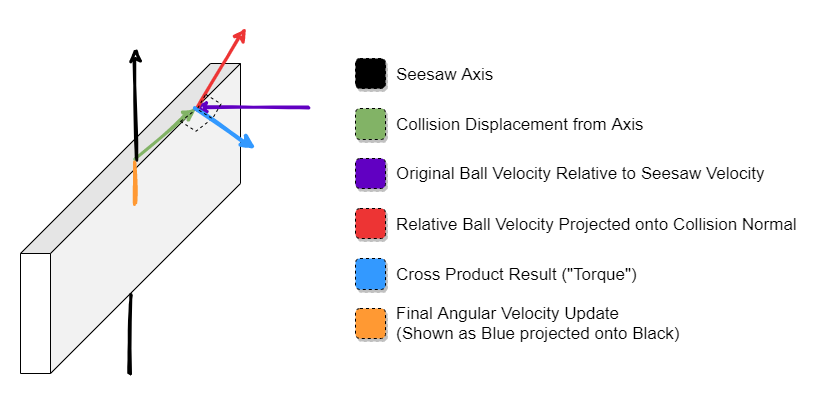

# Seesaws: Slightly Less Obvious Than You Might Imagine, But Still Pretty Straightforward

Hey everyone! I'm back to working on Rolled Out again this summer after taking a half-year or so off for school-related stuff. I previously worked on rebuilding our collision physics system, and I'm now working on implementing new mechanics for the game! For this post, I'll try to keep it short and sweet and talk a bit about seesaws, a game mechanic which I recently implemented.

Seesaws: you know them and love them. You've know what they're like from IRL experience as a kid, and have probably seen them in other marble-rolling or platforming games as well. In Rolled Out, we create a seesaw by declaring that some otherwise-normal triangle mesh _is_ a seesaw, and giving it an axis to rotate about. Seesaws are special from a physics perspective because the ball affects their motion _and_ their motion affects the ball. When the ball touches a trimesh we've decided is a seesaw, we want the ball's distance from the seesaw axis, as well as the ball's velocity against the seesaw, to affect how fast the seesaw is rotating (its _angular velocity_). A rotating seesaw should also affect the ball: when it collides with the ball, the ball should react as if any other animated trimesh collided with it. Seesaws also affect their own animation: a seesaw's _springiness_ controls how much it tries to reset to a neutral angle, and its _friction_ limits how fast it can rotate about its axis in general.

## Simulating Seesaw Motion

When computing a seesaw's motion, we don't care about certain properties that a "real" physical seesaw would have, such as its [moment of inertia](https://en.wikipedia.org/wiki/Moment_of_inertia). Ultimately, we just need to decide how much to add or subtract to the seesaw's angular velocity based on whichever criteria we decide _looks_ realistic enough. As eluded to earlier, in this simple model there are three things which will affect a seesaw's angular velocity: springiness, friction, and ball collision. The first two are very simple to compute. For springiness, multiply how much the seesaw is rotated compared to neutral by a per-seesaw springiness value, and add this to the seesaw's angular velocity. Friction follows in a similar vein: multiply the seesaw's _velocity_ by a per-seesaw friction constant, and add this to the seesaw's angular velocity. Adjusting the seesaw's angular velocity based on collision with the ball takes a bit more math.

If we were simulating a real seesaw, we might think of the ball's effect on the seesaw in terms of [torque](https://en.wikipedia.org/wiki/Torque), which is related to how much force the ball applies to the seesaw. However, in this physics engine we're not really concerned with modeling forces per-se, but rather just changes in velocity, and that goes for modeling the ball as well. So instead, we use the ball's velocity relative to the seesaw as a gauge for how much "force" it is applying to the seesaw. You might be wondering though: if the ball is sitting motionless on a seesaw, how could a velocity of zero affect the seesaw? Great question. In the real world, a ball sitting on a seesaw would push the seesaw down due to the force of gravity; in the game, the ball will actually has a small velocity pointing downward before it touches the seesaw. The ball has this initial downward velocity as a direct result of simulating the force of gravity in the game.

So, the amount we add to the seesaw's angular velocity is related to the ball's velocity when it touches the seesaw, cool. What else do we need to do? First, we need to take the dot product of the ball's velocity relative to the seesaw with the collision normal, scaled by the collision normal. The gist of why we need to do this is that when the ball collides with a triangle, only the velocity going _towards_ it should affect the seesaw, whereas the "sliding" velocity should not. The normal varies greatly depending on whether the ball collided with a triangle face, edge, or vertex. Next, we take the cross product of this vector with the vector pointing from the seesaw's axis to the point which the ball collided with the seesaw. In layman's terms, this does three things for us: it makes the seesaw rotate faster if the ball hit further away from the seesaw axis, it makes the seesaw rotate faster if the ball hit the seesaw more head-on, and it tells us whether to affect the seesaw's rotation in the clockwise or counterclockwise direction. Finally, taking the dot product of this vector with a vector representing the seesaw's rotation axis gives us a single number to add to the seesaw's angular velocity, which may be positive or negative depending on rotation direction. In practice, we scale this final number by a _sensitivity_ constant, which lets us make bigger seesaws feel like they have more mass and thus accelerate slower.

Maybe you don't want to see an equation, but how about a picture?

## Ball Collision with Seesaw

When the ball hits a seesaw, it should get a collision knockback as well, and this varies depending on where it hit the seesaw and how fast the seesaw is rotating. For the most part we can treat the seesaw like any other animated stage mesh in this regard, except for a small caveat: we want the seesaw's speed to be affected by a ball collision _before_ applying a collision response to the ball. If the ball hits a super-sensitive seesaw at high speed, we don't want the ball to bounce off the seesaw like it's a brick wall, we want the ball to first affect the seesaw's velocity, and then bounce back based on the seesaw's _new_ velocity.

What about updating the seesaw's angle of rotation? This is done based on the seesaw's current angular velocity _before any ball collisions occur_. If we updated the seesaw's angle after ball collisions occurred, the seesaw might sometimes look like it's clipping into the ball.

## Farewell

This went a little longer than I wanted, but still not too bad hopefully. That's all for now, see you next time!
